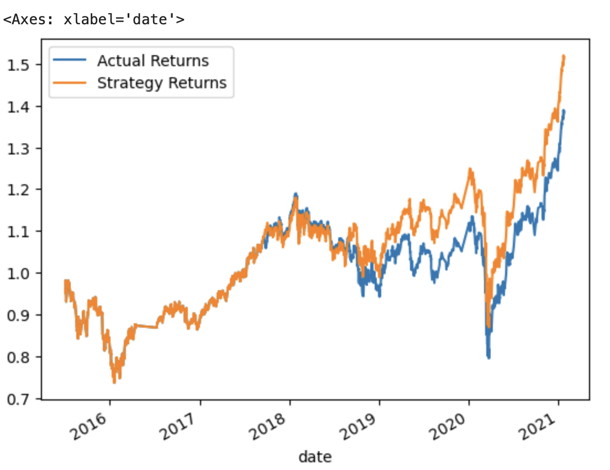

# ML_Trading

## Background

For this Challenge, you’ll assume the role of a financial advisor at one of the top five financial advisory firms in the world. Your firm constantly competes with the other major firms to manage and automatically trade assets in a highly dynamic environment. In recent years, your firm has heavily profited by using computer algorithms that can buy and sell faster than human traders.
The speed of these transactions gave your firm a competitive advantage early on. But, people still need to specifically program these systems, which limits their ability to adapt to new data. You’re thus planning to improve the existing algorithmic trading systems and maintain the firm’s competitive advantage in the market. To do so, you’ll enhance the existing trading signals with machine learning algorithms that can adapt to new data.

## What You're Creating

You’ll combine your new algorithmic trading skills with your existing skills in financial Python programming and machine learning to create an algorithmic trading bot that learns and adapts to new data and evolving markets.
In a Jupyter notebook, you’ll do the following:
Implement an algorithmic trading strategy that uses machine learning to automate the trade decisions.
Adjust the input parameters to optimize the trading algorithm.
Train a new machine learning model and compare its performance to that of a baseline model.

## Create an Evaluation Report

In the previous sections, you updated your README.md file with your conclusions. To finish this section, add a summary evaluation report at the end of the README.md file. For this report, express your final conclusions and analysis. Support your findings by using the PNG images that you created.

### Model 1 

Short Window = 4 

Long Window = 100

Data Off Set = 3 Months

F1 Scores:

-1.0 : 0.07

1.0  : 0.71

### Model 2 

F1 Scores: 

-1.0 : 0.38
1.0  : 0.61

